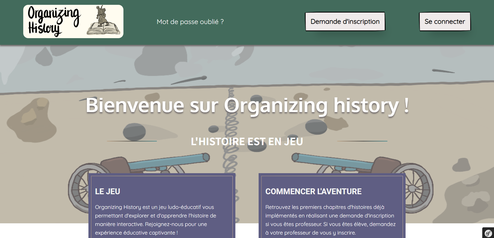
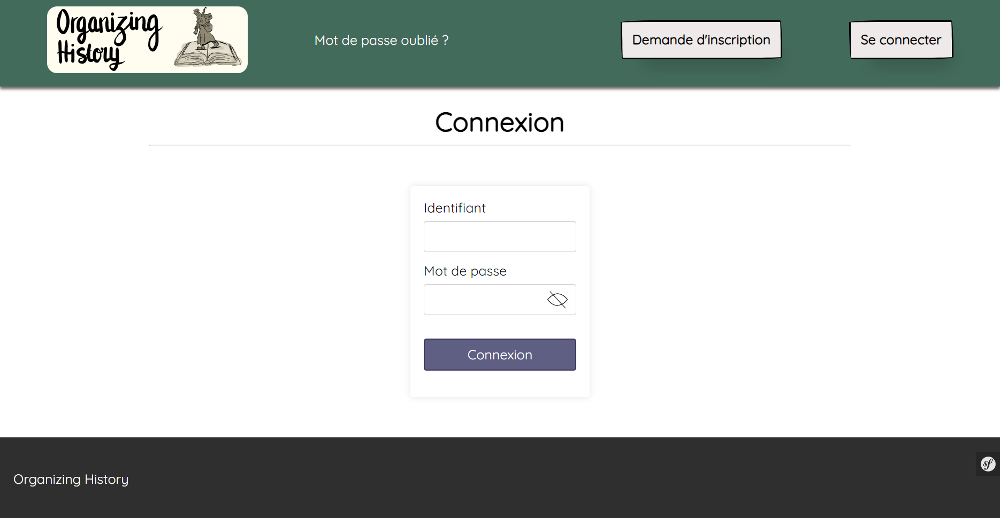
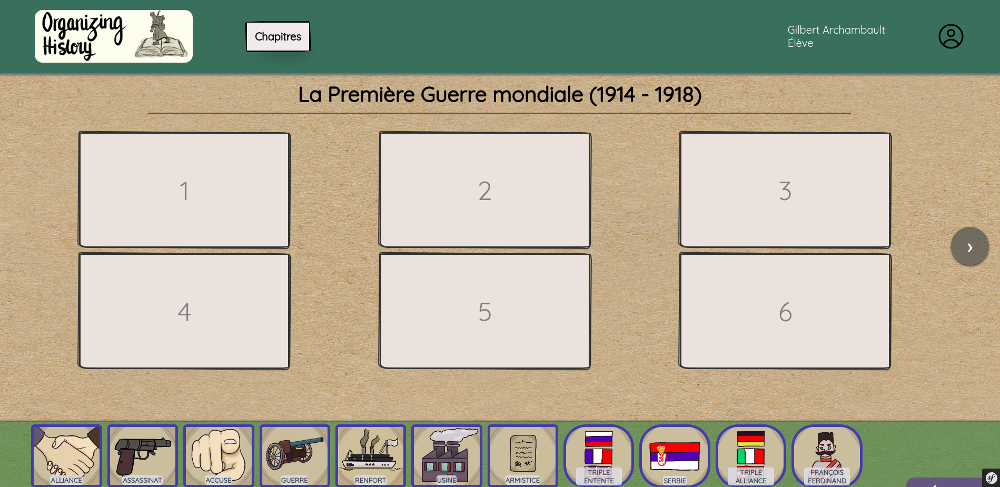

#   Organizing History

Organizing History est une application web destinée aux professeurs d'histoire et à leurs classes de 3ème.
Les professeurs peuvent donner accès à l'application à leurs élèves afin qu'ils puissent jouer et réviser leur cours.
Ils peuvent également avoir accès à la progression des élèves de ses classes.
Ce jeu est un support pour réviser leurs leçons d'une manière amusante.

Modèle de Fichier RDG README --- Général --- Version 1 (26/01/2023)
Ce fichier été créé le : 26/01/2023 par Soukaïna Khoubbaz.
Dernière mise à jour le : 28/01/2023.

Adresses de contact :
soukaina.khoubbaz@etu.univ-grenoble-alpes.fr
aylin.guventurk@etu.univ-grenoble-alpes.fr
thijs.veenhoven@etu.univ-grenoble-alpes.fr
nathan.simiand@etu.univ-grenoble-alpes.fr
paul.maget@etu.univ-grenoble-alpes.fr
quentin.estienne@etu.univ-grenoble-alpes.fr
mathieu.bucket@etu.univ-grenoble-alpes.fr
hassan-idibei.hamid@etu.univ-grenoble-alpes.fr

##  Images du jeu
.
.
.

##  Fonctionnalités
### Professeur
1.  Creer un salon avec les niveaux qu’il veut

2.  Demander la création de comptes élèves sur un salon qui lui appartient

3.  Suivre la progression des élèves

### Elève

1.  Accéder aux niveaux disponibles du salon et y jouer

2.  Suivre sa progression dans les niveaux


##  Utilisation

# Depuis le réseau de l'IUT 2 de Grenoble

Si vous possédez un compte utilisateur UGA vous pouvez taper les urls suivants dans un navigateur web (privilégiez Google Chrome) sur les machines de l'IUT:
```
http://192.168.14.118 
https://192.168.14.118
```
si vous n'êtes pas à l'IUT vous pouvez vous connecter sur transit puis taper un des urls ci-dessus.


# Connexion avec redirection de port au sein d'un tunnel ssh:

La manière la plus sécurisé de se connecter au site depuis n'importe où est la suivante (en considérant que vous avez un compte utilisateur UGA pouvant accéder au serveur transit).

Tapez dans un terminal une de ces 2 commandes:

pour accéder au site en version http:
```
ssh -L 3600:192.168.14.118:80 login@transit.iut2.univ-grenoble-alpes.fr
```
pour accéder au site en version https:
```
ssh -L 3600:192.168.14.118:443 login@transit.iut2.univ-grenoble-alpes.fr

```

avec "login" étant votre login UGA. Assurez vous de bien laisser ouvert le terminal ayant executé la commande et de ne pas écrire ou éxécuter de commande à l'intérieur de celui-ci, cela pourrait fermer la connexion.

note : vous pouvez remplacer le port 3600 par n'importe quel numéro de port mais assurez vous que celui-ci soit accessible et qu'il ne soit pas déjà utilisé. (voir liste de ports fréquemments utilisés selon Ionos https://www.ionos.fr/digitalguide/serveur/know-how/ports-tcpet-udp/). Si vous voulez vous connecter à la fois au site en http et au site en https en même temps, assurez vous de ne pas rentrer le même numéro de port vers lequelle rediriger le flux.

# Accès au site web après redirection
Vous pouvez maintenant taper http://localhost:3600 ou https://localhost:3600 ,en fonction du port que vous avez redirigé afin d'accéder au site.

# Accès au site web depuis internet
Vous pouvez également taper une de ces 2 urls depuis n'importe quel réseau afin de vous connecter au site:

pour le site en http:
```
organising-history.ddns.net
```

pour le site en https:
```
organising-history.fr
```

ATTENTION : la connexion à travers ces urls passe par une machine faisant office de proxy.La sécurité de vos données n'est aucunement assurée sur ces 2 urls. Privilégiez la redirection de port afin d'avoir une connexion sécurisée.


##  Avoir le projet en local (adressé aux développeurs)
Si vous souhaitez reprendre ce projet, voici les instructions à suivre pour permettre à votre machine de le faire tourner en local en partant du principe que votre machine n'a aucun composant nécessaire déjà installé. Vous pouvez sauter certaines étapes si vous savez ce que vous faites.


Récurérer le projet :
Copier le lien suivant
https://gricad-gitlab.univ-grenoble-alpes.fr/iut2-info-stud/2023-s3/s3.01/team-13/organizing-history.git

I.  Conditions d'installation
Vous aurez besoin d'une machine ayant le système d'exploitation Windows et d'au moins 250Mo d'espace mémoire . L'application a été crée pour être supportée par le navigateur Google Chrome.

1.  Installation de PHP

Si vous avez déjà PHP installé sur votre machine, s'assurer que vous possèdez la dernière version
```
php -v
```
Si ce n'est pas le cas, installer PHP sur le site officiel :
https://windows.php.net/download#php-8.3
Nous vous conseillons fortement de suivre ce tutoriel expliquant simplement son installation :
https://grafikart.fr/tutoriels/install-php-windows-1114

2.  Installation de Composer
Composer est un manager de dépendances de packages qui va nous servir à créer des projets symfony.
On peut l’installer depuis GitHub mais il existe un setup.exe qui permet d’installer l’application facilement.
https://getcomposer.org/download/

3.  Installation de  Symfony
Si ce n'est pas le cas, installer PHP sur le site officiel :
https://windows.php.net/download#php-8.3
Nous vous conseillons fortement de suivre ce tutoriel expliquant simplement son installation :
https://grafikart.fr/tutoriels/install-php-windows-1114

2.  Installation de Composer
Composer est un manager de dépendances de packages qui va nous servir à créer des projets symfony.
On peut l’installer depuis GitHub mais il existe un setup.exe qui permet d’installer l’application facilement.
https://getcomposer.org/download/

3.  Installation de Symfony CLI
On a ensuite besoin de Symfony CLI. On peut l’installer depuis github mais
le plus simple est d’utiliser Scoop, un installeur en ligne de commande pour Windows.
Pour cela, il faut éxécuter ces deux commandes dans un shell powershell.
```
Set-ExecutionPolicy -ExecutionPolicy RemoteSigned -Scope CurrentUser
Invoke-RestMethod -Uri https://get.scoop.sh | Invoke-Expression
```

Ensuite on installe symfony-CLI :
```
scoop install symfony-cli
```
Éxecutez la commande suivante pour vérifier que votre machine est prête à créer un projet
Symfony
```
symfony check:requirements
```
4.  Installation des librairies et packages nécessaire au fonctionnement de notre application
4.1 Librairie doctrine
Doctrine est une librairie utilisée avec Symfony permettant de gérer des bases de données et les mettre à jour durant l'exécution.
Commandes à executer sur le powershell :

```
composer require symfony/orm-pack

composer require --dev symfony/maker-bundle
```
5.  Installation d'un IDE 
Nous vous conseillons fortement d'installer et d'utiliser l'IDE PHPStorm sur la page officielle : https://www.jetbrains.com/fr-fr/phpstorm/download/#section=windows 

6. Accès au site web local

taper la commande suivante à la racine de votre projet pour lancer le serveur local integré à Symfony:

```
symfony serve -d
```
Pour accéder au site sur un navigateur vous devez maintenant taper :
```
https://127.0.0.1:8000
```

#   Identifiants et mots de passe pour se connecter à notre application

<dl>
<dt>Professeur</dt>
<dd>Identifiant : blancham</dd>
<dd>Mot de passe : 123456 </dd>

<dt>Elève</dt>
<dd>Identifiant : archambg</dd>
<dd>Mot de passe : 123456 </dd>

<dt>Administrateur</dt>
<dd>Identifiant : admin</dd>
<dd>Mot de passe : 123456 </dd>
</dl>

##  Problèmes connus
Le lecteur PDF peut ne pas fonctionner en fonction des navigateurs utilisés. Privilégiez Google Chrome
##  Contributions
Les co-auteurs de cette application sont Soukaïna Khoubbaz, Aylin Guventurk, Thijs Veenhover, Nathan Simiand, Paul Maget, Quentin Estienne, Hamid Idibeï et Mathieu Bucket.

##  Licence
Le jeu est protégé sous licence [MIT](https://choosealicense.com/licenses/mit/).

##Legacy README
### Équipe `13`

<dl>
<dt>Chef de projet</dt>
<dd>SIMIAND Nathan</dd>
<dt>Membres</dt>
<dd>

- GUVENTURK Aylin
- MAGET Paul
- BUCKET Mathieu
- KHOUBBAZ Souakïna
- VEENHOVEN Thijs
- ESTIENNE Quentin
- HAMID Idibeï

</dd>

---

# SAÉ 3·01 (dépôt de rendu)

Ce dépôt est le dépôt de référence de votre équipe pour la SAÉ 3·01.
Vos rendus se feront en déposant tous les fichiers pertinents pour chaque itération ici.

Ce dépôt est initialement organisé comme suit :
```console
rendus
├── docs/
│   └── README.md
├── .gitattributes
├── .gitignore
└── README.md
```

**Vous déposerez vos rendus textuel au format `pdf` dans le dossier `docs/`.<br>
Tout document textuel dans un autre format ne sera pas considéré.**


##### Fichiers particuliers

Les deux fichiers `.gitattributes` et `.gitignore` sont liés à la configuration de git.<br>
Vous pouvez modifier le fichier `.gitignore` en fonction des technologies utilisées et de l'organisation du dépôt choisie.<br>
Il est vivement déconseillé de modifier le fichier `.gitattributes`.


